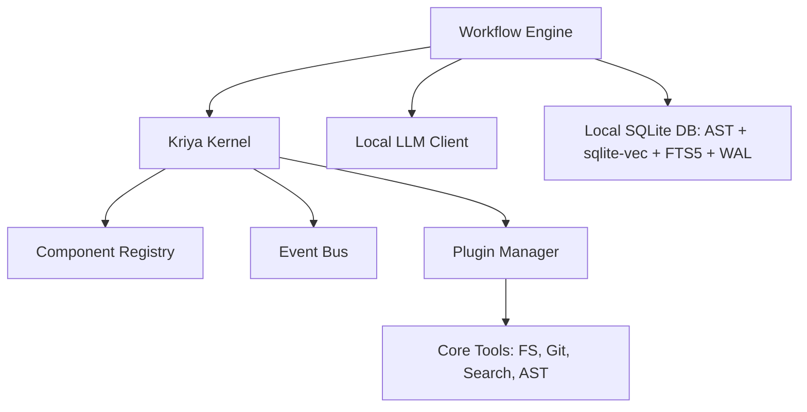

# Kriya — Local-First AI Engineering Platform

Kriya is a production-grade AI Engineering Platform that helps software engineers, architects, and engineering teams build, understand, modify, review, and maintain software systems locally and securely.

Kriya runs entirely on **local infrastructure** — local LLMs, local tools, local embeddings, and a local MCP server — with zero external cloud dependencies.

---

## 1. Core Principles

1. **Platform over Application**: Built as a core engine with replaceable registries and event hooks.
2. **Configuration over Hardcoding**: Fully customized via a declarative config schema.
3. **Plugin over Monolith**: Extending Kriya doesn't require modifying the core. All capabilities, tools, and skills are plugins.
4. **Repository-Aware**: Indexes files syntactically and semantically to provide rich context to LLMs.
5. **Production Quality**: Built-in quality gates compilation and test suite verification.

---

## 2. Key Features

- **Multi-Agent Workflow**: Coordinates Planner, Architect, Developer, and Reviewer agents to satisfy feature requests and run auto-repair loops.
- **Incremental Codebase Indexing**: Syntactically chunks Python/Java/XML files, fetches local Ollama vector embeddings, and builds a SQLite database with WAL and timeout lock safety. Bypasses unchanged files using content hashes (git blob SHA-1).
- **Method-Level Syntactic Chunker**: Chunk boundaries align to code structures (class headers, function headers, method signatures), prepending enclosure package, class javadocs, and path headers.
- **Hybrid RAG & camelCase Splitting**: Joins cosine vector similarity with FTS5 lexical searches, splitting camelCase/snake_case tokens during indexing to route symbol name matches.
- **Fast-Fail Quality Gates**: Compiles and runs targeted tests first inside a persistent git worktree sandbox (.kriya/worktree) to preserve compilation caches and reduce latencies. The sandbox is synced with any uncommitted changes already in your workspace before each run (not just git HEAD) — a git worktree only reflects committed history by design, so without this, any in-progress/uncommitted work (the normal state of an active feature branch) would be silently invisible to the Developer's sandbox, breaking any goal that builds on or preserves it.
- **Runtime Verification Gate** (`autonomy.run_verification_enabled`, default on): after compile/test gates pass, Kriya can actually *run* the generated app and have an LLM judge grade the captured output against your goal — compiling and passing unit tests doesn't prove the thing works. A passing run marks every skill that contributed to the change as `verified` (see below).
- **Skill Verification & Gap Detection**: skills carry a `verified`/`unverified` status, not just content. If a goal touches a skill Kriya doesn't have verified information for (or names a technology with no matching skill at all), `generate` pauses and asks you for a URL/file/text reference before proceeding, extracts rules from it, and folds them into the current run. A skill only becomes `verified` via an objective signal — a passing Runtime Verification run, or an explicit human `kriya skills promote` — never by self-reported model confidence. Extraction never overwrites an existing rule (exact match, or a deterministic word-overlap check that catches the same fact reworded differently) or an existing example file — a fresh, unreviewed extraction can add to a skill but never silently clobber previously-curated content.
- **Skill Conflict Detection**: two skills can each be individually correct and still conflict once both are active for the same run (e.g. two broker skills pinning different values for the same shared port). When skills matched for a goal genuinely contradict each other, `generate` pauses and asks which one should govern — your answer is remembered per exact rule pair, so the same conflict is never asked about twice.
- **Live Lookup** (`autonomy.web_lookup_enabled`, **off by default** — the one opt-in exception to "zero cloud dependency"): auto-resolves a skill gap by searching a configured backend (e.g. a self-hosted SearXNG instance, `search.base_url`) instead of always waiting on a human to paste a URL. Search queries are built *exclusively* from bare technology-name strings already extracted by code (never goal text, design text, or your actual code) — a hard, code-enforced boundary, not a prompt instruction a model could ignore. Found references are always shown for a single batch confirmation before use. Tries several ranked results per term, not just the first — real testing showed a single top hit for a well-known library is often a landing page with nothing extractable, so one attempt isn't enough to call it "resolved."
- **Error-Triggered Live Lookup** (same `autonomy.web_lookup_enabled`/`search.base_url` switches): when a Quality Gates compile or Runtime Verification failure repeats identically on a second consecutive Developer retry attempt — a sign the model isn't self-correcting — Kriya tries a live lookup for the failure before the next retry, folding anything found directly into that retry's prompt. Query terms are restricted to Maven/Gradle-style `groupId:artifactId` coordinates found in the error text itself, never the raw error/stack-trace text (which can contain your own class/variable names) — the same hard query-safety boundary as goal/design-stage live lookup. Ephemeral by design: no human confirmation gate (the retry loop is already unattended) and nothing is written to a skill's `rules.txt`. A real live A/B test found this genuinely helps for actual unfamiliar-library knowledge gaps, but not for every repeated failure — many "whack-a-mole" retry failures turn out to be multi-file regeneration consistency issues rather than missing information, which this feature doesn't address (see docs/design.md §2.3.4 for detail).
- **Targeted Single-File Retry**: when a Quality Gates failure names one of your already-written files, Kriya's next Developer retry focuses on just that file instead of regenerating every file again — the target file(s) framed as the fix, every other file shown as read-only reference (its real current content, not just the error text — the full-set retry path never shows the model its own previous attempt at all). Runs on its own independent retry budget (3 attempts, separate from the normal 4+) and always uses your primary model, never the fallback chain — a model swap costs real time (measured 19-43s on Ollama), which would defeat the point of a fast, surgical fix. Identification is pure deterministic text matching against the error output, no LLM call — an error that doesn't name a known file (a bare exit code, a plugin-config error with no source file) simply falls back to today's full-file-set retry, exactly as before this feature existed.
- **Completeness Prevention & Recovery**: the Architect's design is scanned for the files it calls for and injected into the Developer's *first* prompt as an explicit checklist, before generation even happens — not just checked against afterward. If the Developer still omits a required file, the completeness-check failure is a distinct `IncompleteGenerationError` (not a generic error) that routes to a dedicated missing-file recovery retry — sharing Targeted Single-File Retry's budget/no-escalation philosophy, asking for exactly the missing file(s) with the rest of the codebase as reference, instead of a full regeneration or a compile-error-style targeted fix. Found and fixed via a real, from-scratch multi-milestone live validation against an Ignite+Qpid messaging use case — see `docs/design.md` §2.3.4c.
- **Per-Rule Verification Provenance**: a skill's `verified` flag is skill-level, but a passing run usually only exercises a handful of its actual rules. Kriya separately tracks each individual rule extracted from a skill gap or live lookup as unverified until it's specifically part of a passing run's context — `kriya skills show` flags them inline (`[unverified]`), and generation prompts show them in a distinct section so the model treats them with appropriate caution rather than as equally authoritative as long-standing, battle-tested rules. No `rules.txt` format change — pre-existing content is untouched.
- **Per-Role Model Selection** (`agent_llms`, optional — every role defaults to your primary `llm`): Planner, Architect, Reviewer, RunVerifier, and SkillGapAgent can each be pointed at a different local model, each with its own independent escalation chain. **Only configure genuinely different models per role if your machine can keep all of them loaded simultaneously** — measured directly, alternating between different models on a machine that can't made a real run ~3.8x *slower*, not faster, because every switch pays Ollama's full model-reload cost. Leave this unset, or point every role at the same model, to guarantee zero reload overhead.
- **Resumable Runs** (`generate --resume` / `fix --resume`): a checkpoint is saved after each stage (Plan, Design, Developer-passed-Quality-Gates) so a killed or crashed run doesn't force starting over — `--resume` picks up the latest checkpoint for the workspace, `--resume-id <id>` a specific one. Resume is opt-in only (never inferred from goal text) and strict: any drift in the workspace's git state, the resolved config, or the goal/error text since the checkpoint was saved invalidates it entirely, falling back to a fresh run with a warning rather than a partial resume. Checkpoints are deleted on normal completion and only ever survive a kill/crash. Requires the workspace to be a git repository.
- **Autonomy Guardrails**:
  - Automatically flags modifications touching sensitive paths (e.g. `.env`, credentials, workflows).
  - Triggers interactive TTY-isolated `[y/n]` confirmation in the CLI if risk thresholds (line limits or sensitive paths) are hit, bypassing piped stream collisions.
  - **Process-level execution hardening** (`autonomy.sandbox_execution`, default on): compile/test commands run by the quality-gate loop (`generate`/`fix`) and the `shell` tool run with a restricted environment (an explicit allowlist of variables, so API keys/tokens/credentials sitting in your shell env aren't inherited) and CPU/memory resource limits. The `shell` tool additionally requires interactive confirmation (`kriya tools execute shell ... -y` to bypass).
    - **Known limitation**: this reduces blast radius (secret-leak-via-env-var, runaway/destructive execution) but does **not** provide full sandboxing — executed code still has real filesystem and network access as your OS user. It can still read credential files directly off disk (e.g. `~/.ssh`, `~/.aws/credentials`) or reach the network. Full isolation would require containerization, which is not implemented.
- **MCP Tool Server**: Integrates native tool sets into workspace workflows as a standardized MCP server (via the `mcp` SDK's `MCPServer`).
- **Interactive Session** (`kriya repl`, or just bare `kriya`/`kriya -c kriya.yaml` on a real terminal): a persistent process for issuing several commands in a row instead of restarting the CLI each time — a boxed, multi-line-capable prompt (via `prompt_toolkit`), with `--config` applied automatically to every command. Bare invocation only starts the session on an actual interactive terminal (checked via `sys.stdin.isatty()`) — piped/non-TTY input (scripts, CI) falls back to today's help text instead, so nothing hangs waiting on stdin by accident. Deliberately thin: each typed line dispatches straight into the exact same command group the regular one-shot CLI uses, so there's no separate parser or duplicated logic to drift out of sync. Type `/` to see every command Kriya supports, filtered live as you keep typing.
  - **Natural-language routing** (`routing.enabled`, on by default): type plain English instead of an explicit command inside the session — Kriya routes it to the right command (`generate`/`ask`/`fix`/`review`/`analyze`/`skills`) via an embeddings classifier plus a narrow LLM in-scope gate, asking which you meant if it's not confident rather than guessing, and saying so plainly if it's not something Kriya does (installing packages, deploying, git operations, and similar stay explicitly out of scope). Explicit commands are unaffected either way - routing only activates when a typed line's first word isn't already a real command name. Needs `ollama pull embeddinggemma` — a separate, dedicated embedding model from whatever `embedding.model` you use for code search, since it measurably outperformed the packaged default at this specific short-phrase classification task; if it isn't pulled, routing fails loudly with the exact pull command needed and disables itself for the rest of the session (or set `routing.enabled: false` to opt out entirely). See `spikes/version_b_routing/README.md` for the feasibility investigation this was validated against.

---

## 3. Architecture Design

Kriya is built on a modular kernel structure utilizing a component registry, event bus, and plugin system:



---

## 4. Setup Guide

### Prerequisites
- Python 3.10 or higher.
- [Ollama](https://ollama.com/) running locally.
- Pull the default models:
  ```bash
  ollama pull qwen2.5-coder:32b
  ollama pull nomic-embed-text:latest
  ```

### Installation
Clone the repository and install it in editable mode inside a virtual environment:

```bash
# Create and activate virtual environment
python3 -m venv .venv
source .venv/bin/activate

# Install dependencies and local CLI entry points
pip install -e .
```

For a reproducible install pinned to known-working dependency versions (recommended for CI or production), install from the generated lock file first:
```bash
pip install -r requirements.txt
pip install -e . --no-deps
```
`requirements.txt` is generated with `pip-compile` (from `pip-tools`, a `dev` extra) — regenerate it after changing `dependencies` in `pyproject.toml`:
```bash
pip install -e ".[dev]"
pip-compile --extra dev --output-file=requirements.txt pyproject.toml
```

---

## 5. Usage Guide

All commands are run using the `.venv/bin/kriya` CLI executable.

### System Check
Ensure local Ollama models and server links are connected:
```bash
.venv/bin/kriya doctor
```
Exits non-zero if any check reports `[ERROR]` (e.g. LLM/embedding server unreachable), so it's safe to gate scripts on (`kriya doctor && kriya generate ...`). A `[WARNING]` (e.g. configured model not found in the server's list) doesn't affect the exit code.

### Inspect Resolved Configuration
Print the fully-merged config (defaults + your `kriya.yaml`) as JSON - useful for confirming what a relative path or config layer actually resolved to:
```bash
.venv/bin/kriya -c kriya.yaml config
```
Every `api_key` field and every MCP server's `env` values are redacted (`***REDACTED***`) before printing - safe to paste into a bug report or share on a call.

### Check Plugin Health
List every discovered plugin under `plugins.directory` and whether it actually initialized successfully (not just whether its class loaded):
```bash
.venv/bin/kriya plugins
```
Exits non-zero if any plugin's `initialize()` failed - each plugin is attempted independently, so one broken plugin doesn't hide the status of the others.

### Discover Active Tools
List all active native and custom MCP tools:
```bash
.venv/bin/kriya tools list
```
Both `tools list` and `tools execute` initialize each discovered plugin independently - a plugin that fails to initialize only makes *its own* tools unavailable (with a `[WARNING]`), it doesn't block tools from other plugins or prevent executing a specific tool you name directly.

### Analyze & Index Codebase
Recursively scan and compile the semantic vector index for a directory:
```bash
.venv/bin/kriya analyze kriya/core
```
*Note: Subsequent runs on the same folder will check `mtimes` and index incrementally (completing instantly).*

### Render & Generate Prompt Templates
Render one of the 4 built-in templates (`system_instructions`, `code_review`, `refactor`, `generate_code`), or your own custom `<name>.jinja` files via `-t/--template-dir` (checked first, before falling back to the built-ins):
```bash
.venv/bin/kriya prompt render refactor -v filepath=main.py -v code_content="..." -v guidelines="..."
.venv/bin/kriya prompt render my_template -t ./my_prompts -v foo=bar
```
Or ask a local model to draft a well-structured prompt from a one-line description, useful as a starting point for a real `kriya generate` goal:
```bash
.venv/bin/kriya prompt generate "a REST API for managing a todo list"
```

### Run Code Review
Analyze files or directories for bugs, style consistency, and architectural quality:
```bash
# Review a single file
.venv/bin/kriya review kriya/core/kernel.py

# Review all modified files in a directory (via Git)
.venv/bin/kriya review kriya/core
```

### Autonomous Generation Workflow
Generate or refactor code autonomously based on a goal:
```bash
.venv/bin/kriya generate "Create a calculator module in python with test cases"
```

### Resuming an Interrupted Run
`generate` and `fix` checkpoint after each stage (Plan, Design, Developer-passed-Quality-Gates) to a git-backed workspace's `.kriya/checkpoints/` directory. If a run is killed or crashes, re-run the exact same command with `--resume` (picks the latest checkpoint) or `--resume-id <id>` (a specific one, printed on failure) to skip the stages that already completed instead of starting over:
```bash
.venv/bin/kriya generate "Create a calculator module in python with test cases" --resume
```
Resume is opt-in only - never automatic - and strict: if the workspace's git state, the resolved config, or the goal/error text has changed at all since the checkpoint was saved, Kriya refuses to resume and starts a fresh run instead (with a warning), rather than attempting a partial or best-effort resume. A checkpoint is deleted the moment its run completes normally (success or an explicit rejection) - it only survives on disk after a kill or crash. Requires the workspace to be a git repository (needed to reliably detect whether anything changed).

### Manage Engineering Skills
List, inspect, and maintain the verification status of skills:
```bash
.venv/bin/kriya skills list                              # shows [VERIFIED]/[UNVERIFIED] per skill
.venv/bin/kriya skills show <skill_name>                 # verification provenance + rules/instructions
.venv/bin/kriya skills promote <source> <target> --all    # push an approved lesson into the shared skill library
.venv/bin/kriya skills unverify <skill_name>              # reset a skill you know has gone stale
```

### Start the Kriya MCP Server
Run the local MCP tool server:
```bash
.venv/bin/kriya-mcp
```

### Run Tests
Execute the test suite (entirely mocked - no live LLM/embedding calls, runs offline):
```bash
.venv/bin/pytest
```
A separate, deliberately excluded tier (`tests/test_live_smoke.py`, marked `live_model`) runs the real CLI against an actual local LLM/embedding endpoint - narrow assertions ("did the real pipeline complete without crashing", not code-generation quality). Needs Ollama running locally:
```bash
.venv/bin/pytest -m live_model
```
CI runs this tier in a separate, non-blocking job (`.github/workflows/ci.yml`'s `live-model-smoke`) that installs Ollama and pulls a small model fresh - it exists to catch integration/regression bugs in Kriya's own request/response handling that only a real model response can trigger, not to grade generation quality.

---

## 6. Configuration

Kriya loads configuration parameters from `default_config.yaml`. Here is the default schema:

```yaml
llm:
  provider: "openai"
  base_url: "http://localhost:11434/v1"
  model: "qwen2.5-coder:32b"
  temperature: 0.2

embedding:
  provider: "ollama"
  base_url: "http://localhost:11434/v1"
  model: "nomic-embed-text:latest"

autonomy:
  mode: "guardrails"                      # Options: autonomous | guardrails
  risk_threshold_lines: 300               # Trigger review escalation if file write exceeds this limit
  sensitive_paths:                        # Sensitive file matching patterns
    - ".*\\.env$"
    - ".*secrets.*"
    - ".*workflows.*"
  run_verification_enabled: true          # Actually run the generated app and grade output before applying
  run_verification_timeout_seconds: 90
  web_lookup_enabled: false                # Opt-in per project; also requires search.base_url below

search:
  base_url: ""                             # e.g. "http://localhost:8080" for a self-hosted SearXNG instance
  top_k: 3                                 # Candidate results tried per term before giving up on it

# Optional - every role below defaults to the primary llm block above if unset.
# Developer is not configurable here; it always uses llm/llm_chain above.
#
# IMPORTANT: only configure genuinely DIFFERENT models per role if your machine can
# keep all of them loaded in memory simultaneously (verify with `ollama ps` - it
# should show every configured model as resident, not evicting each other). Measured
# directly: on a machine that can't, alternating between different models on every
# agent call made a real run ~3.8x SLOWER than using one model throughout (each
# switch pays Ollama's full model-reload cost, which dwarfs any inference-speed gain
# from a smaller model). If you haven't verified this, leave agent_llms unset
# entirely, or point every role at the SAME model as below - there is then never a
# reload, by construction, since Ollama only swaps when the requested model name
# actually changes.
agent_llms:
  planner:
    llm:
      model: "qwen3-coder:30b"
      base_url: "http://localhost:11434/v1"
  reviewer:
    llm:
      model: "qwen3-coder:30b"
      base_url: "http://localhost:11434/v1"
  run_verifier:
    llm:
      model: "qwen3-coder:30b"
      base_url: "http://localhost:11434/v1"
  skill_gap:
    llm:
      model: "qwen3-coder:30b"
      base_url: "http://localhost:11434/v1"
  # architect: left unset -> uses the primary llm model too

paths:
  plugins: "./plugins"
  skills: "./skills"
  memory: "./memory"
```
