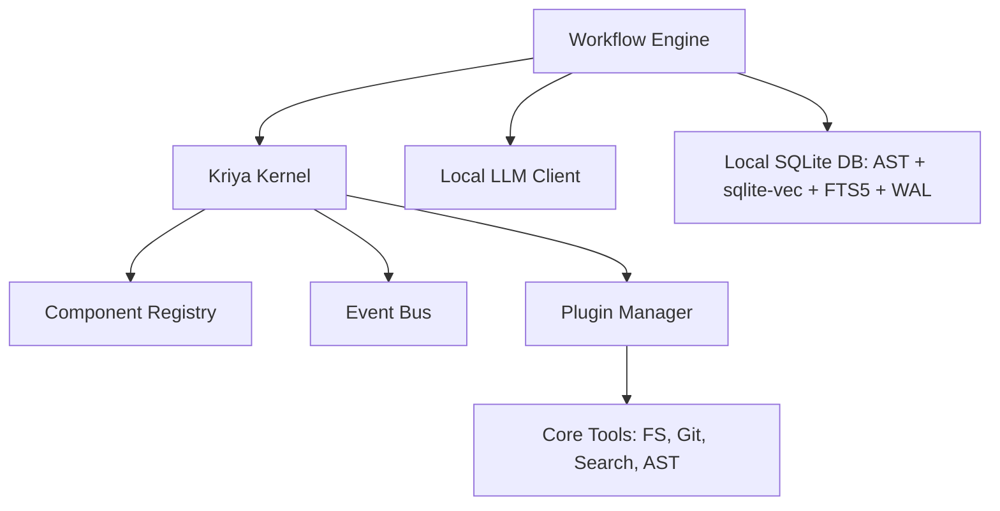

# Kriya — Local-First AI Engineering Platform

Kriya is a production-grade AI Engineering Platform that helps software engineers, architects, and engineering teams build, understand, modify, review, and maintain software systems locally and securely.

Kriya runs entirely on **local infrastructure** — local LLMs, local tools, local embeddings, and a local MCP server — with zero external cloud dependencies.

---

## 1. Core Principles

1. **Platform over Application**: Built as a core engine with replaceable registries and event hooks.
2. **Configuration over Hardcoding**: Fully customized via a declarative config schema.
3. **Plugin over Monolith**: Extending Kriya doesn't require modifying the core. All capabilities, tools, and skills are plugins.
4. **Repository-Aware**: Indexes files syntactically and semantically to provide rich context to LLMs.
5. **Production Quality**: Built-in quality gates compilation and test suite verification.

---

## 2. Key Features

- **Multi-Agent Workflow**: Coordinates Planner, Architect, Developer, and Reviewer agents to satisfy feature requests and run auto-repair loops.
- **Incremental Codebase Indexing**: Syntactically chunks Python/Java/XML files, fetches local Ollama vector embeddings, and builds a SQLite database with WAL and timeout lock safety. Bypasses unchanged files using content hashes (git blob SHA-1).
- **Method-Level Syntactic Chunker**: Chunk boundaries align to code structures (class headers, function headers, method signatures), prepending enclosure package, class javadocs, and path headers.
- **Hybrid RAG & camelCase Splitting**: Joins cosine vector similarity with FTS5 lexical searches, splitting camelCase/snake_case tokens during indexing to route symbol name matches.
- **Fast-Fail Quality Gates**: Compiles and runs targeted tests first inside a persistent git worktree sandbox (.kriya/worktree) to preserve compilation caches and reduce latencies.
- **Autonomy Guardrails**:
  - Automatically flags modifications touching sensitive paths (e.g. `.env`, credentials, workflows).
  - Triggers interactive TTY-isolated `[y/n]` confirmation in the CLI if risk thresholds (line limits or sensitive paths) are hit, bypassing piped stream collisions.
- **FastMCP Tool Server**: Integrates native tool sets into workspace workflows as a standardized MCP server.

---

## 3. Architecture Design

Kriya is built on a modular kernel structure utilizing a component registry, event bus, and plugin system:



---

## 4. Setup Guide

### Prerequisites
- Python 3.10 or higher.
- [Ollama](https://ollama.com/) running locally.
- Pull the default models:
  ```bash
  ollama pull qwen2.5-coder:32b
  ollama pull nomic-embed-text:latest
  ```

### Installation
Clone the repository and install it in editable mode inside a virtual environment:

```bash
# Create and activate virtual environment
python3 -m venv .venv
source .venv/bin/activate

# Install dependencies and local CLI entry points
pip install -e .
```

---

## 5. Usage Guide

All commands are run using the `.venv/bin/kriya` CLI executable.

### System Check
Ensure local Ollama models and server links are connected:
```bash
.venv/bin/kriya doctor
```

### Discover Active Tools
List all active native and custom MCP tools:
```bash
.venv/bin/kriya tools list
```

### Analyze & Index Codebase
Recursively scan and compile the semantic vector index for a directory:
```bash
.venv/bin/kriya analyze kriya/core
```
*Note: Subsequent runs on the same folder will check `mtimes` and index incrementally (completing instantly).*

### Run Code Review
Analyze files or directories for bugs, style consistency, and architectural quality:
```bash
# Review a single file
.venv/bin/kriya review kriya/core/kernel.py

# Review all modified files in a directory (via Git)
.venv/bin/kriya review kriya/core
```

### Autonomous Generation Workflow
Generate or refactor code autonomously based on a goal:
```bash
.venv/bin/kriya generate "Create a calculator module in python with test cases"
```

### Start the Kriya MCP Server
Run the local MCP tool server:
```bash
.venv/bin/kriya-mcp
```

### Run Tests
Execute the comprehensive test suite (42 unit tests):
```bash
.venv/bin/pytest
```

---

## 6. Configuration

Kriya loads configuration parameters from `default_config.yaml`. Here is the default schema:

```yaml
llm:
  provider: "openai"
  base_url: "http://localhost:11434/v1"
  model: "qwen2.5-coder:32b"
  temperature: 0.2

embedding:
  provider: "ollama"
  base_url: "http://localhost:11434/v1"
  model: "nomic-embed-text:latest"

autonomy:
  mode: "guardrails"                      # Options: autonomous | guardrails
  risk_threshold_lines: 300               # Trigger review escalation if file write exceeds this limit
  sensitive_paths:                        # Sensitive file matching patterns
    - ".*\\.env$"
    - ".*secrets.*"
    - ".*workflows.*"

paths:
  plugins: "./plugins"
  skills: "./skills"
  memory: "./memory"
```
