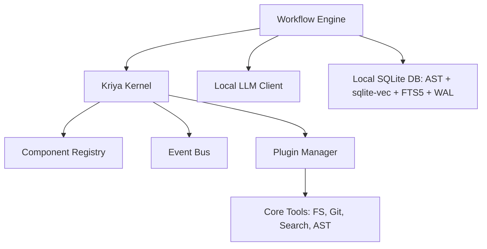

# Kriya — Local-First AI Engineering Platform

Kriya is a production-grade AI Engineering Platform that helps software engineers, architects, and engineering teams build, understand, modify, review, and maintain software systems locally and securely.

Kriya runs entirely on **local infrastructure** — local LLMs, local tools, local embeddings, and a local MCP server — with zero external cloud dependencies.

---

## 1. Core Principles

1. **Platform over Application**: Built as a core engine with replaceable registries and event hooks.
2. **Configuration over Hardcoding**: Fully customized via a declarative config schema.
3. **Plugin over Monolith**: Extending Kriya doesn't require modifying the core. All capabilities, tools, and skills are plugins.
4. **Repository-Aware**: Indexes files syntactically and semantically to provide rich context to LLMs.
5. **Production Quality**: Built-in quality gates compilation and test suite verification.

---

## 2. Key Features

- **Multi-Agent Workflow**: Coordinates Planner, Architect, Developer, and Reviewer agents to satisfy feature requests and run auto-repair loops.
- **Incremental Codebase Indexing**: Syntactically chunks Python/Java/XML files, fetches local Ollama vector embeddings, and builds a SQLite database with WAL and timeout lock safety. Bypasses unchanged files using content hashes (git blob SHA-1).
- **Method-Level Syntactic Chunker**: Chunk boundaries align to code structures (class headers, function headers, method signatures), prepending enclosure package, class javadocs, and path headers.
- **Hybrid RAG & camelCase Splitting**: Joins cosine vector similarity with FTS5 lexical searches, splitting camelCase/snake_case tokens during indexing to route symbol name matches.
- **Fast-Fail Quality Gates**: Compiles and runs targeted tests first inside a persistent git worktree sandbox (.kriya/worktree) to preserve compilation caches and reduce latencies.
- **Runtime Verification Gate** (`autonomy.run_verification_enabled`, default on): after compile/test gates pass, Kriya can actually *run* the generated app and have an LLM judge grade the captured output against your goal — compiling and passing unit tests doesn't prove the thing works. A passing run marks every skill that contributed to the change as `verified` (see below).
- **Skill Verification & Gap Detection**: skills carry a `verified`/`unverified` status, not just content. If a goal touches a skill Kriya doesn't have verified information for (or names a technology with no matching skill at all), `generate` pauses and asks you for a URL/file/text reference before proceeding, extracts rules from it, and folds them into the current run. A skill only becomes `verified` via an objective signal — a passing Runtime Verification run, or an explicit human `kriya skills promote` — never by self-reported model confidence.
- **Skill Conflict Detection**: two skills can each be individually correct and still conflict once both are active for the same run (e.g. two broker skills pinning different values for the same shared port). When skills matched for a goal genuinely contradict each other, `generate` pauses and asks which one should govern — your answer is remembered per exact rule pair, so the same conflict is never asked about twice.
- **Live Lookup** (`autonomy.web_lookup_enabled`, **off by default** — the one opt-in exception to "zero cloud dependency"): auto-resolves a skill gap by searching a configured backend (e.g. a self-hosted SearXNG instance, `search.base_url`) instead of always waiting on a human to paste a URL. Search queries are built *exclusively* from bare technology-name strings already extracted by code (never goal text, design text, or your actual code) — a hard, code-enforced boundary, not a prompt instruction a model could ignore. Found references are always shown for a single batch confirmation before use. Tries several ranked results per term, not just the first — real testing showed a single top hit for a well-known library is often a landing page with nothing extractable, so one attempt isn't enough to call it "resolved."
- **Per-Rule Verification Provenance**: a skill's `verified` flag is skill-level, but a passing run usually only exercises a handful of its actual rules. Kriya separately tracks each individual rule extracted from a skill gap or live lookup as unverified until it's specifically part of a passing run's context — `kriya skills show` flags them inline (`[unverified]`), and generation prompts show them in a distinct section so the model treats them with appropriate caution rather than as equally authoritative as long-standing, battle-tested rules. No `rules.txt` format change — pre-existing content is untouched.
- **Per-Role Model Selection** (`agent_llms`, optional — every role defaults to your primary `llm`): Planner, Architect, Reviewer, RunVerifier, and SkillGapAgent can each be pointed at a different local model — e.g. a leaner model for planning/review and a fast small model for structured utility calls (skill-gap extraction, run-verification judging), keeping the primary/strongest model reserved for Developer's actual code generation. Each role also gets its own optional escalation chain, independent of Developer's existing quality-gate-driven retry chain — free-text roles (Planner/Architect/Reviewer) escalate only on a hard call failure, JSON-mode roles (RunVerifier, SkillGapAgent) also escalate on an unparseable response.
- **Autonomy Guardrails**:
  - Automatically flags modifications touching sensitive paths (e.g. `.env`, credentials, workflows).
  - Triggers interactive TTY-isolated `[y/n]` confirmation in the CLI if risk thresholds (line limits or sensitive paths) are hit, bypassing piped stream collisions.
  - **Process-level execution hardening** (`autonomy.sandbox_execution`, default on): compile/test commands run by the quality-gate loop (`generate`/`fix`) and the `shell` tool run with a restricted environment (an explicit allowlist of variables, so API keys/tokens/credentials sitting in your shell env aren't inherited) and CPU/memory resource limits. The `shell` tool additionally requires interactive confirmation (`kriya tools execute shell ... -y` to bypass).
    - **Known limitation**: this reduces blast radius (secret-leak-via-env-var, runaway/destructive execution) but does **not** provide full sandboxing — executed code still has real filesystem and network access as your OS user. It can still read credential files directly off disk (e.g. `~/.ssh`, `~/.aws/credentials`) or reach the network. Full isolation would require containerization, which is not implemented.
- **MCP Tool Server**: Integrates native tool sets into workspace workflows as a standardized MCP server (via the `mcp` SDK's `MCPServer`).

---

## 3. Architecture Design

Kriya is built on a modular kernel structure utilizing a component registry, event bus, and plugin system:



---

## 4. Setup Guide

### Prerequisites
- Python 3.10 or higher.
- [Ollama](https://ollama.com/) running locally.
- Pull the default models:
  ```bash
  ollama pull qwen2.5-coder:32b
  ollama pull nomic-embed-text:latest
  ```

### Installation
Clone the repository and install it in editable mode inside a virtual environment:

```bash
# Create and activate virtual environment
python3 -m venv .venv
source .venv/bin/activate

# Install dependencies and local CLI entry points
pip install -e .
```

For a reproducible install pinned to known-working dependency versions (recommended for CI or production), install from the generated lock file first:
```bash
pip install -r requirements.txt
pip install -e . --no-deps
```
`requirements.txt` is generated with `pip-compile` (from `pip-tools`, a `dev` extra) — regenerate it after changing `dependencies` in `pyproject.toml`:
```bash
pip install -e ".[dev]"
pip-compile --extra dev --output-file=requirements.txt pyproject.toml
```

---

## 5. Usage Guide

All commands are run using the `.venv/bin/kriya` CLI executable.

### System Check
Ensure local Ollama models and server links are connected:
```bash
.venv/bin/kriya doctor
```

### Discover Active Tools
List all active native and custom MCP tools:
```bash
.venv/bin/kriya tools list
```

### Analyze & Index Codebase
Recursively scan and compile the semantic vector index for a directory:
```bash
.venv/bin/kriya analyze kriya/core
```
*Note: Subsequent runs on the same folder will check `mtimes` and index incrementally (completing instantly).*

### Run Code Review
Analyze files or directories for bugs, style consistency, and architectural quality:
```bash
# Review a single file
.venv/bin/kriya review kriya/core/kernel.py

# Review all modified files in a directory (via Git)
.venv/bin/kriya review kriya/core
```

### Autonomous Generation Workflow
Generate or refactor code autonomously based on a goal:
```bash
.venv/bin/kriya generate "Create a calculator module in python with test cases"
```

### Manage Engineering Skills
List, inspect, and maintain the verification status of skills:
```bash
.venv/bin/kriya skills list                              # shows [VERIFIED]/[UNVERIFIED] per skill
.venv/bin/kriya skills show <skill_name>                 # verification provenance + rules/instructions
.venv/bin/kriya skills promote <source> <target> --all    # push an approved lesson into the shared skill library
.venv/bin/kriya skills unverify <skill_name>              # reset a skill you know has gone stale
```

### Start the Kriya MCP Server
Run the local MCP tool server:
```bash
.venv/bin/kriya-mcp
```

### Run Tests
Execute the comprehensive test suite (42 unit tests):
```bash
.venv/bin/pytest
```

---

## 6. Configuration

Kriya loads configuration parameters from `default_config.yaml`. Here is the default schema:

```yaml
llm:
  provider: "openai"
  base_url: "http://localhost:11434/v1"
  model: "qwen2.5-coder:32b"
  temperature: 0.2

embedding:
  provider: "ollama"
  base_url: "http://localhost:11434/v1"
  model: "nomic-embed-text:latest"

autonomy:
  mode: "guardrails"                      # Options: autonomous | guardrails
  risk_threshold_lines: 300               # Trigger review escalation if file write exceeds this limit
  sensitive_paths:                        # Sensitive file matching patterns
    - ".*\\.env$"
    - ".*secrets.*"
    - ".*workflows.*"
  run_verification_enabled: true          # Actually run the generated app and grade output before applying
  run_verification_timeout_seconds: 90
  web_lookup_enabled: false                # Opt-in per project; also requires search.base_url below

search:
  base_url: ""                             # e.g. "http://localhost:8080" for a self-hosted SearXNG instance
  top_k: 3                                 # Candidate results tried per term before giving up on it

# Optional - every role below defaults to the primary llm block above if unset.
# Developer is not configurable here; it always uses llm/llm_chain above.
agent_llms:
  planner:
    llm:
      model: "devstral-small-2:24b"
      base_url: "http://localhost:11434/v1"
    llm_chain: []                          # optional escalation chain, just for this role
  reviewer:
    llm:
      model: "devstral-small-2:24b"
      base_url: "http://localhost:11434/v1"
  run_verifier:
    llm:
      model: "qwen2.5-coder:7b"
      base_url: "http://localhost:11434/v1"
  skill_gap:
    llm:
      model: "qwen2.5-coder:7b"
      base_url: "http://localhost:11434/v1"
  # architect: left unset -> uses the primary llm model, same as Developer

paths:
  plugins: "./plugins"
  skills: "./skills"
  memory: "./memory"
```
