# Kriya's Ideal End-to-End Flow — Golden Use Case (Ignite + Qpid + Spring XML)

Working document to map what Kriya *should* do, start to finish, for a task like "build the Ignite+Qpid+SpringXML messaging app" — then use it to spot gaps, including ones we haven't hit yet in live testing.

**Includes a "fresh install, zero skills" trace** — everything else in this document was validated against skills we spent 3+ days hand-refining. What actually happens for a brand-new user with none of that? Traced through the real code (§ SKILLGAP branch, Diagram 1) rather than assumed — see open question #6.

**Legend:** 🟢 implemented & verified · 🟡 implemented but has a known gap/friction · 🔴 not implemented — proposed here · 🔵 decision/gate point

---

## Diagram 1 — Overall Pipeline

```mermaid
flowchart TD
    classDef done fill:#2ecc71,stroke:#27ae60,color:#000,font-weight:bold
    classDef partial fill:#f1c40f,stroke:#f39c12,color:#000,font-weight:bold
    classDef gap fill:#e74c3c,stroke:#c0392b,color:#fff,font-weight:bold
    classDef gate fill:#3498db,stroke:#2980b9,color:#fff

    Start(["User goal:\n'Build Ignite+Qpid+SpringXML app'"]) --> KG

    KG{"🔵 KnowledgeGuard:\nlibrary/version postdates\nmodel's training cutoff?"}:::gate
    KG -->|yes| KG1["🟢 Block, require --yes /\n--knowledge-policy / --ack-knowledge-gap"]:::done
    KG -->|no| ANALYZE
    KG1 --> ANALYZE

    ANALYZE["🟢 Repository analysis\n(AST/vector/lexical index,\nexisting deps/conventions)"]:::done --> SKILLS

    SKILLS["🟢 Skill matching\n(repo facts + goal/tag match,\nsupported_versions ranges)"]:::done --> SKILLGAP

    SKILLGAP{"🟢 Unverified/missing skill\nfor a mentioned tech?\n(extract_library_versions() vs\nskill tags — confirmed live: works\neven with zero version numbers\nin the goal text)"}:::gate
    SKILLGAP -->|yes| LOOKUP{"🔵 web_lookup_enabled AND\nsearch.base_url configured?\n(both OFF by default —\na fresh install has neither)"}:::gate
    LOOKUP -->|yes| PRESEND{"🟢 Pre-send confirmation —\nauto_approve opt-in OR real-time\ncallback shown exact terms +\nURL, fails closed otherwise\n(fixed: previously fired &\ndiscarded silently under -y)"}:::gate
    PRESEND -->|approved| LOOKUP1["🟢 Live lookup attempts\nautonomous extraction —\nquery template fixed ('{term}\nexample', not 'documentation') —\nverified live to surface real\nGitHub examples/quick-start code\nfor the same terms that\npreviously returned landing pages"]:::done
    PRESEND -->|declined / -y with no opt-in| ASK
    LOOKUP -->|no| ASK
    LOOKUP1 -->|found usable content| CONFLICT
    LOOKUP1 -->|nothing usable| ASK
    ASK{"🔵 -y / non-interactive run?"}:::gate
    ASK -->|yes| SKIP["🔴 Silently auto-skipped —\nconfirmed via code: on_skill_gap\nreturns None under -y, only a\ndim console line marks it.\nGeneration proceeds best-effort:\nmodel must already know every\nIgnite/Qpid gotcha unaided"]:::gap
    ASK -->|no| HUMAN["🟢 Prompt human for\nreference material"]:::done
    SKIP --> CONFLICT
    HUMAN --> CONFLICT
    SKILLGAP -->|no| CONFLICT

    CONFLICT{"🔵 2+ active skills\nwith conflicting rules?"}:::gate
    CONFLICT -->|yes| CONFLICT1["🟢 skill_conflict_callback,\nremembered per pair"]:::done
    CONFLICT -->|no| RAG
    CONFLICT1 --> RAG

    RAG["🟢 Graph RAG retrieval\n(hybrid vector+lexical seed files\n+ dependency-graph neighborhood,\ntoken-budgeted context)"]:::done --> LEARNED

    LEARNED["🟢 Untrusted learned-knowledge RAG\n(kriya learn corpus, fenced\n+ never treated as instructions)"]:::done --> PLAN

    PLAN["🟢 Planner Agent\n(architecture, files, deps,\nrun/verify strategy)"]:::done --> DESIGN

    DESIGN["🟡 Architect Agent\n('Files to Create or Modify' —\nfixed this session, but run\ncommand / JVM flags still not\nstructured output, just prose)"]:::partial --> GENVERIFY

    GENVERIFY["Generate & Verify\n(see Diagram 2)"] --> QGRESULT

    QGRESULT{"🔵 Quality Gates\nultimately passed?"}:::gate
    QGRESULT -->|no| REPORT_FAIL["🔴 Report failure —\ncategories now include\nenvironment_failure, but\nknowledge-gap/skill-gap/approval-\nrejected paths report differently,\nand NEITHER pass nor fail ever\nmentions 'this ran with a silently\nskipped skill gap' anywhere"]:::gap
    QGRESULT -->|yes| APPROVAL

    APPROVAL{"🔵 Human approval gate\n(HITL mode / sensitive path /\ndiff size over threshold)?"}:::gate
    APPROVAL -->|needed, rejected| REPORT_REJECT["🟢 Report rejected,\nworktree changes discarded"]:::done
    APPROVAL -->|needed, approved / not needed| APPLY

    APPLY["🟢 Apply worktree changes\nto real workspace"]:::done --> LESSON

    LESSON["🟡 Lesson extraction —\nauto-accrual now gated on\nactual final-content usage,\nbut still fallback-escalation-\ntriggered only, not general"]:::partial --> REVIEW

    REVIEW["🟢 Reviewer pass\n(informational, non-gating)"]:::done --> TRACE

    TRACE["🟢 Trace log persisted\n(plan, retries, gate outcomes,\nretrieved chunks, model hops)"]:::done --> DONE(["Done"])

    REPORT_FAIL --> DONE2(["Done — failed"])
    REPORT_REJECT --> DONE2
```

---

## Diagram 2 — Generate & Verify (the retry loop, where most real bugs have lived)

```mermaid
flowchart TD
    classDef done fill:#2ecc71,stroke:#27ae60,color:#000,font-weight:bold
    classDef partial fill:#f1c40f,stroke:#f39c12,color:#000,font-weight:bold
    classDef gap fill:#e74c3c,stroke:#c0392b,color:#fff,font-weight:bold
    classDef gate fill:#3498db,stroke:#2980b9,color:#fff

    A(["Enter retry loop"]) --> PREGEN["🟢 Full-set prompt gains explicit\n'preserve these dependencies'\nchecklist (from workspace_path's\noriginal pom.xml) — same pattern\nas the 'Required files' checklist"]:::done
    PREGEN --> B["🟢 Developer generates\n(full-set / targeted / missing-files,\nverified-vs-unverified rule split)"]:::done
    B --> PRE{"🟢 First attempt only: stack==java?\n(reliable here — pom.xml now\nexists whether fresh or extended)"}:::gate
    PRE -->|yes, once| PRE1["🟢 Toolchain preflight —\njava/mvn version mismatch?\nWarn once (log + toolchain_warning\nresult field, shown even on success)"]:::done
    PRE -->|no / already checked| C
    PRE1 --> C
    C["🟢 Compile check\n(mvn/gradle/javac, fast-fail)"]:::done --> D{"🔵 Compiled OK?"}:::gate
    D -->|no| E{"🔵 Dependency regression\n(existing dep silently dropped)?"}:::gate
    E -->|yes| E1["🟢 Reported clearly AND now\nexplicitly pre-empted via the\ncheck-list above, not just\nreactively caught after the fact"]:::done
    E -->|no| F{"🔴 Environment/toolchain\nfailure? (JVM startup crash,\nmissing mvn/java binary)"}:::done
    F -->|yes| F1["🟢 Circuit breaker: stop\nretrying immediately, distinct\n[ENVIRONMENT/TOOLCHAIN ISSUE]\nreport"]:::done
    F -->|no| G["🟢 classify failure, extract\nimplicated file(s), decide\ntargeted vs full-set next attempt"]:::done
    E1 --> G
    D -->|yes| H["🟢 Targeted tests\n(from compiler output /\nmodified test files)"]:::done
    H --> I{"🔵 Tests pass?"}:::gate
    I -->|no| G
    I -->|yes| J{"🔵 Runtime Verification\nneeded? (goal-explicit or\njudge()-inferred)"}:::gate
    J -->|no| N
    J -->|yes| K["🟡 RunVerifier judge():\nnow sees pom.xml content\n(fixed this session) — still\ninfers run command fresh\nevery attempt, not a structured\ncontract from Plan/Design"]:::partial
    K --> L["🟢 Execute resolved command\n(_resolve_run_command corrects\nknown exec:java/exec:exec\nmismatches, python→sys.executable)"]:::done
    L --> M{"🔵 Output graded as\nmatching success criteria?"}:::gate
    M -->|no| G
    M -->|yes| N["🟢 Full regression suite\n(once, against real workspace)"]:::done
    N --> O{"🔵 Regression passed?"}:::gate
    O -->|no| G
    O -->|yes| P(["Quality Gates: PASSED"])

    G --> G1{"🔵 Repeated identical\nfailure? (compile/run_verification)"}:::gate
    G1 -->|yes, web_lookup enabled| G2["🟢 Live-lookup augmentation\n(noise-normalized signature —\nfixed this session)"]:::done
    G1 -->|no| G3["🟢 Build targeted/full-set\nretry prompt"]:::done
    G2 --> G3
    G3 --> G4{"🔵 Retry budget\n(full-set + targeted)\nexhausted?"}:::gate
    G4 -->|no| B
    G4 -->|yes, retry_count > 0| G5{"🔵 llm_chain\nfallback available?"}:::gate
    G5 -->|yes| G6["🟢 Escalate to next\nfallback model"]:::done
    G6 --> B
    G5 -->|no| Q(["Quality Gates: FAILED —\nto Reviewer with errors"])
    G4 -->|yes, no fallback| Q
```

---

## Open questions surfaced by mapping this out (candidates to iron out)

1. ~~**Toolchain preflight is manual, not automatic.**~~ **Resolved.** Runs once per generation run, the first attempt where stack detection is reliable (pom.xml now exists whether fresh or extended) — before any retry is spent. Turned out the "ideal" placement drawn in v1 of this diagram (before repository analysis) wasn't actually achievable: for a fresh Java project, no pom.xml exists yet at that point, so stack is unknowable that early. Moved into Diagram 2 to reflect where it actually runs. Warns (doesn't block), surfaced both in real time and via a persisted `toolchain_warning` field shown even on a successful run.
2. ~~**Skills model facts as flat, unconditional rules.**~~ **Resolved — chose the lightweight option.** Considered a structured `[jdk<24]`-style condition syntax in `rules.txt` (deterministic, but real schema/parser work for a pattern seen exactly once) vs. surfacing the resolved JDK as a plain fact and letting the model reason against a rule written to be genuinely conditional in prose. Went with the fact-injection approach: `_java_toolchain_fact()` puts "Target JVM: JDK X" into the same prompt block skill rules already ride on, and the qpid rule was rewritten to state both halves (required 17.0.10–23.x, forbidden 24+) instead of just the half true when first verified. Caught a second stale consequence in the same pass: the exec:java-vs-exec:exec guidance was *also* derived entirely from "the security-manager flag is always needed," so it was quietly wrong for JDK 24+ too — fixed in the same commit rather than left for a third rediscovery.
3. ~~**Dependency-regression tug-of-war never got a real fix.**~~ **Resolved - did exactly the pattern this question proposed.** `get_pom_dependencies()` (promoted to a module-level function in `kriya/tools/validate.py` for reuse without constructing a validator) reads `workspace_path`'s original `pom.xml` once, before the retry loop starts, and the resulting "preserve these existing dependencies" checklist is now appended to every full-set attempt's task description - mirroring `required_files_prompt_block`'s already-proven shape exactly, since passive reference material alone was confirmed live (M2 attempts 2 and 4) not sufficient to stop the drop from recurring. Deliberately scoped to full-set attempts only, not targeted retries, matching the same precedent.
4. **The run command is inferred fresh every attempt, not declared once.** `_resolve_run_command()`'s pom.xml-shape correction is a good safety net, but the deeper fix might be having Architect/Plan emit a structured run-command contract (goal, main class, required JVM flags) that RunVerifier consumes instead of re-guessing from raw file content each time.
5. **Failure reporting isn't uniform.** `environment_failure` and `toolchain_warning` are now distinct, clearly-labeled fields. Knowledge-gap, unresolved-skill-gap, and approval-rejected are each reported differently (different messages, different code paths). Is there value in one small "failure_category" enum surfaced consistently across all of them, so a user (or a script) can always ask "why did this fail" the same way?
6. ~~**Fresh-install experience for a genuinely new technology combination is opaque.**~~ **Resolved, in two increments.** Detection itself always worked — `extract_library_versions()` correctly flags Ignite/Qpid as unknown even from natural-language goal text with zero version numbers.
   - **Increment 1 (safety/authorization)**: compared against how Claude Code/Cline/Cursor-style tools close this same gap (open web access woven into the agentic loop, visible in real time, no fixed retry budget) versus Kriya's deliberate local-first bet (a durable, auditable, verified skill ledger instead of ephemeral per-session search). Fixed a real, concrete finding: under `-y`, an outbound live-lookup query previously fired and got silently discarded regardless, with zero human visibility. Every query (all 3 trigger points) now requires pre-send confirmation or an explicit `autonomy.web_lookup_auto_approve` opt-in.
   - **Increment 2 (capability)**: root-caused *why* Qpid's live-lookup track record was 0/3 real autonomous extractions, rather than accepting it as a fixed limitation. Testing my own natural web-search behavior side-by-side with Kriya's actual query (`"{term} documentation"`) against a real, running local SearXNG instance surfaced the answer directly: "documentation" consistently returns a landing/index page; a task-specific phrasing doesn't. Verified concretely with the exact term shapes Kriya sends, independently re-confirmed through Kriya's own `fetch_url_text()` (not just a promising-looking snippet) - real extractable content, including the exact correct `IgniteCache` import path a skill rule had to be hand-written for earlier this session. One-line fix: query suffix changed from `"documentation"` to `"example"`. Deliberately not a multi-query fallback chain - the same live testing tripped real rate-limit/CAPTCHA suspension on the SearXNG instance's own upstream engines after a modest number of requests, a concrete reliability constraint against multiplying query volume.
   - Both fixes apply uniformly across all 3 live-lookup trigger points. What's *not* claimed: this doesn't guarantee live lookup now succeeds for every gap - it corrects a systematically bad query, verified against two real examples, not a promise of universal coverage.

Not proposing fixes yet — this is the map. Pick one and we scope it properly, same as every other item this session.
